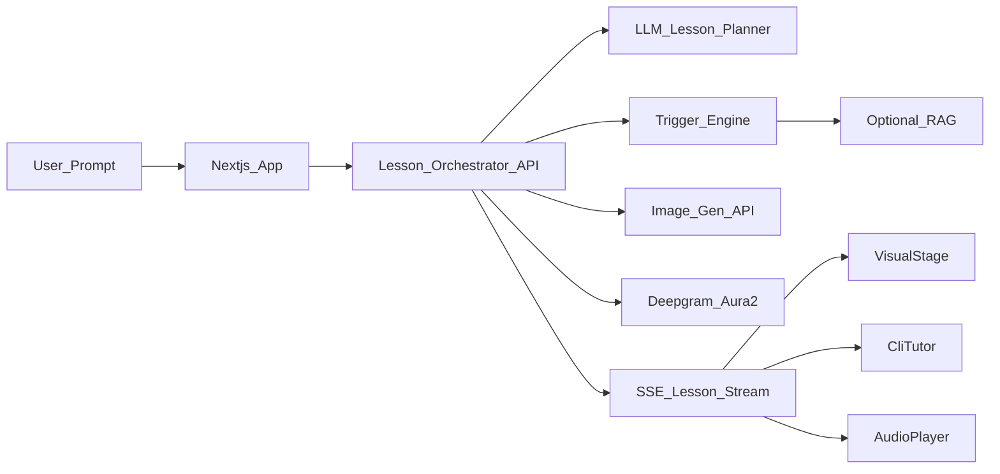

# Visual Education — Requirements, Stack, Architecture

## Defaults locked for this plan
- **Platform:** Web app (desktop-first, mobile-usable)
- **Visuals (v1):** Pedagogical teaching sketches (Rough.js / scene JSON) — classroom-style concept drawings, not photo image gen and not system-design diagrams. Trigger gates when to draw / keep / retire.
- **Scope (v1):** Open prompt → structured lesson stream (API wrapper). Reliability improves once your Trigger Engine + optional RAG land.
- **Voice:** Deepgram Aura-2 TTS (streaming). STT only if we add mic later.
- **DB / backend platform:** **Supabase** (Postgres + Auth + Storage + pgvector when similarity index lands). Deploy app on Vercel or Render; Supabase is the data plane.

If you want curated Java-only or hybrid overlays instead, say so and we adjust before any build.

---

## Product requirements (mapped)

### Core experience
1. User enters a prompt (concept / problem).
2. System produces a **Lesson Plan** (ordered beats).
3. **Left pane:** relevant metaphor image appears first; updates only when the Trigger Engine says the concept beat changed.
4. **Right pane (CLI UI):** streams real code + plain-language token teaching in lockstep with the visual.
5. **Voice:** Deepgram narrates each beat (not a flat monotone dump).
6. Visuals are never decorative-idle: if still on screen, they stay because they are still relevant; otherwise swap.
7. After the concept completes, CLI shows a **human reverse-engineered solution summary** — how a learner’s brain would cook the solution — **not** AI chain-of-thought (“step 2 → step 3”).
8. **Pacing:** not too fast, not too slow; avoid classroom failure modes (rushing vs monotonous repetition).

### Explicit non-goals (v1)
- Runtime memory visualizer (Python Tutor)
- System-design architecture diagrams as the primary visual
- Local model hosting / fine-tuning
- Full curriculum CMS and payments (Auth/lesson save via Supabase can land early; billing later)

### Functional requirements
| ID | Requirement |
|---|---|
| FR1 | Prompt intake + lesson generation (structured JSON beats) |
| FR2 | Dual-pane UI: VisualStage + CliTutor |
| FR3 | Token/beat streaming: code + explanation appear together |
| FR4 | Image generation + relevance-gated display |
| FR5 | Voice narration synced to active beat |
| FR6 | Pace controller (speed, pause, skip, replay beat) |
| FR7 | Closing “human reverse-engineer” summary in CLI |
| FR8 | Pluggable Trigger Engine interface (you own implementation) |
| FR9 | Optional RAG slot for metaphor/concept grounding |

### Non-functional
- Latest stable deps only; pin exact versions at install time
- API keys server-side only
- Streaming UX (SSE or WebSocket) so left/right/voice feel live
- Latency budget: first visual < ~5–8s; first CLI line sooner if possible via parallel calls

---

## Lesson data model (contract everything syncs to)

One shared timeline drives UI, voice, and images:

```ts
type LessonBeat = {
  id: string;
  order: number;
  kind: "intro" | "token" | "visual_shift" | "recap" | "human_summary";
  codeDelta?: string;          // what to type into CLI (e.g. "public ")
  highlight?: string;          // token being taught
  narration: string;           // spoken + shown
  metaphorKey?: string;        // e.g. "classroom", "maze"
  imageAction: "none" | "generate" | "keep" | "retire";
  imagePrompt?: string;        // only if generate
  paceHintMs?: number;         // suggested dwell before next beat
  pedagogyNote?: string;       // internal; never shown as AI CoT
};

type LessonPlan = {
  title: string;
  language: string;            // e.g. "java"
  beats: LessonBeat[];
  humanSummary: string;        // final reverse-engineer block
};
```

**Human summary rule (hard):** written as learner cognition (“I need a named box for the idea of a car… so I declare a class…”), never model process language.

---

## Architecture (API-wrapper first)



### Layers
1. **Client (Next.js App Router)**  
   - Prompt bar  
   - `VisualStage` (image + crossfade)  
   - `CliTutor` (terminal aesthetic, typewriter/stream)  
   - `PaceControls` (0.75x / 1x / 1.25x, pause, skip, replay)  
   - `AudioPlayer` (queues TTS chunks per beat)

2. **Orchestrator (Route Handlers / thin BFF)**  
   - Calls LLM → `LessonPlan`  
   - For each beat: ask Trigger Engine → generate/keep/retire image  
   - Streams events to client  
   - Requests TTS per narration chunk (or prefetches next beat)

3. **Trigger Engine (your module — stubbed interface in app)**  
   - Input: current beat, prior metaphorKey, optional RAG hits  
   - Output: `{ imageAction, metaphorKey, imagePrompt?, confidence }`  
   - Heuristics first; RAG later for metaphor library / concept grounding

4. **Providers (swap-friendly adapters)**  
   - `LlmProvider` — lesson planning + human summary  
   - `ImageProvider` — metaphor images  
   - `TtsProvider` — Deepgram Aura-2  
   - `RagProvider` — optional retrieve metaphor templates / pedagogy snippets

### Stream event protocol (client sync)
```ts
type StreamEvent =
  | { type: "plan_meta"; title: string; language: string }
  | { type: "beat_start"; beat: LessonBeat }
  | { type: "code_delta"; text: string }
  | { type: "image"; url: string; metaphorKey: string }
  | { type: "audio"; beatId: string; urlOrStreamRef: string }
  | { type: "human_summary"; text: string }
  | { type: "done" };
```

Orchestrator never lets image/TTS/code drift: **beat_start** is the barrier; code/image/audio for that beat emit only after it.

---

## How each surface works

### Drawing / left pane
- v1: **API image generation** (`gpt-image-2`) from Trigger-approved `imagePrompt`
- Display: full-bleed stage, crossfade on swap, hold on `keep`
- Relevance: Trigger Engine only; client does not invent images
- Later: SVG overlays for token callouts without regenerating whole images

### Code / concept on the right (CLI)
- Monospace terminal chrome (UI only — not a real shell)
- Streams `codeDelta` with caret; parallel plain-text narration lines
- Token highlight for the active `highlight`
- After last teaching beat → print `human_summary` as a distinct CLI section (e.g. `// how you'd think it through`)

### Voice
- Deepgram `aura-2-*` TTS per beat narration
- Prefetch next beat audio while current plays
- Pace controller adjusts: playback rate (Aura-2 supports ~0.7x–1.5x) + dwell between beats

### Pacing mechanism (required subsystem)
| Lever | Behavior |
|---|---|
| Beat dwell | `paceHintMs` from planner, clamped by PaceController |
| User speed | 0.75x / 1x / 1.25x global |
| Pause / skip / replay | User agency always wins |
| Anti-monotony | Planner prompted to vary beat length; no duplicate narration lines; Trigger blocks redundant image regen |
| Anti-rush | Min dwell per beat; don’t start next TTS until prior finishes unless user skips |

---

## Tech stack (latest stable as of 2026-07-24)

Pin exact versions at `npm create` / install time (numbers below are current stables to target):

| Layer | Choice | Target |
|---|---|---|
| Framework | Next.js (App Router) | **16.2.11** (active LTS) |
| UI | React + React DOM | **19.2.8** |
| Language | TypeScript | latest stable 5.x |
| Styling | Tailwind CSS | **v4** |
| LLM | OpenAI API | `gpt-4.1` or current flagship for structured lesson JSON (verify at build) |
| Diagrams | Rough.js + scene JSON | hand-drawn teaching sketches (not photo gen) |
| TTS | Deepgram | Aura-2 (`aura-2-*-en`) |
| Streaming | SSE from Next route handlers | native `ReadableStream` |
| Validation | Zod | latest |
| DB / Auth / Storage | **Supabase** (Postgres) | `@supabase/supabase-js` latest stable |
| Similarity / RAG later | Supabase **pgvector** | metaphor library embeddings when Trigger needs it |
| Package manager | pnpm | latest |
| Hosting | Vercel or Render (app) + Supabase (data) | — |

**API-wrapper rule:** no custom training, no local diffusion, no local TTS in v1. Lesson planning + voice are provider APIs; diagrams render locally via Rough.js + your Trigger Engine.

**Adapter pattern:** each provider behind a small interface (`LlmProvider`, `TtsProvider`, `DiagramRenderer`, `TriggerEngine`).

---

## Trigger Engine + RAG (your ownership)

### Trigger interface (app provides; you implement)
```ts
interface TriggerEngine {
  decide(input: {
    beat: LessonBeat;
    activeMetaphorKey?: string;
    ragSnippets?: string[];
  }): Promise<{
    imageAction: "none" | "generate" | "keep" | "retire";
    metaphorKey?: string;
    imagePrompt?: string;
    confidence: number;
  }>;
}
```

### RAG (phase 1.5, not blocking UI shell)
- Index in Supabase: metaphor templates (`class → classroom`, `for-loop → maze/conveyor`), anti-examples, pedagogy notes
- Retrieve top-k via pgvector for planner + Trigger
- Heuristics can ship first; pgvector similarity when metaphor quality needs it

### Supabase v1 usage (locked)
| Table / feature | Purpose |
|---|---|
| `lessons` | Store prompt, LessonPlan JSON, status |
| `lesson_beats` (optional) | Per-beat audit / replay |
| `metaphors` | Metaphor key, image prompt template, embedding |
| Storage bucket `lesson-images` | Cache generated images (cut regen cost) |
| Auth | Email/OAuth when you want saved history |

Lesson streaming still works without waiting on Auth — Supabase is wired from day one so deploy path is clean.

---

## Suggested repo shape (when we build later)

```text
/app
  /page.tsx                 # prompt + dual pane
  /api/lesson/stream/route.ts
/components
  VisualStage.tsx
  CliTutor.tsx
  PaceControls.tsx
/lib
  /supabase  (client + server helpers)
  /providers  (llm, image, tts, rag)
  /orchestrator
  /pace
  /triggers   # your engine lives here
/types/lesson.ts
```

---

## Build phases (still no code now)

1. **Foundation:** types, provider adapters, SSE protocol, dual-pane shell  
2. **Lesson stream:** LLM → beats → CLI typewriter + image swaps (muted)  
3. **Voice sync:** Deepgram + PaceController  
4. **Trigger plug-in:** wire your engine; stub default heuristic until ready  
5. **Human summary:** dedicated final beat + CLI section  
6. **RAG (optional):** metaphor library retrieval  

---

## Open items (non-blocking)
- Prefer **OpenAI-only** for LLM+images, or split providers?
- Brand name for the app / CLI prompt prefix?
- Any must-support language beyond Java for the first demo?

---

## Success criteria for the foundation
- One prompt produces a synchronized lesson: image beat ↔ code token ↔ voice line  
- Irrelevant images do not appear (Trigger gate)  
- End state shows human reverse-engineer summary, not AI CoT  
- User can slow/speed/pause without desyncing the three channels
