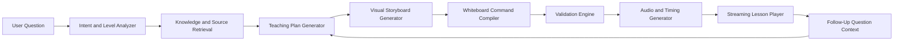
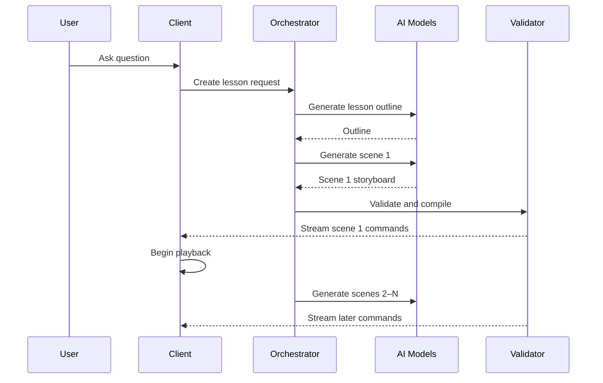
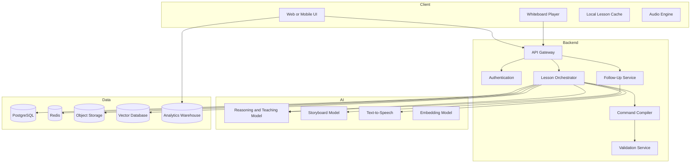

# Magic Whiteboard App — Product and Technical Plan

> **How to use this file:** Product vision, pedagogy, and risk doctrine.  
> **Implementation plan:** `magic-whiteboard-coding-plan.md` (Seathrough-aligned).  
> **Do not** treat stack sections here (Konva, Fastify-style services, 40+ actions, 8-week platform roadmap) as the build checklist — they over-scope relative to the existing Next.js app.

## 1. Product Vision

**Magic Whiteboard** is an AI-powered learning app where users ask questions in natural language and receive explanations that feel like a teacher is working through the answer live on a whiteboard.

Instead of returning only text, the app creates a synchronized lesson containing:

- A spoken or written explanation
- Handwritten-style notes
- Diagrams, arrows, labels, shapes, and highlights
- Step-by-step reveals
- Pauses and transitions
- Interactive controls for asking follow-up questions
- Optional quizzes and practice exercises

The goal is to reproduce the feeling of a patient teacher thinking aloud, drawing, erasing, correcting, and building understanding one step at a time.

---

## 2. Core User Promise

> Ask any question and watch an AI teacher explain it visually, step by step, on a living whiteboard.

The experience should feel:

- **Visual**, not like a chatbot with decorative images
- **Progressive**, showing one thought at a time
- **Human**, with natural pacing and occasional corrections
- **Interactive**, allowing interruptions and follow-up questions
- **Adaptive**, matching the learner's level
- **Replayable**, letting users revisit any step
- **Trustworthy**, showing uncertainty and sources when needed

---

## 3. Target Users

### Primary Users

1. **Students**
   - Mathematics
   - Physics
   - Chemistry
   - Biology
   - Computer science
   - History and geography
   - Exam preparation

2. **Visual learners**
   - People who understand concepts better through diagrams and motion

3. **Teachers and tutors**
   - Generate lesson explanations
   - Create visual examples
   - Reuse lesson boards

4. **Professionals**
   - Understand systems, finance, technology, business processes, and data

5. **Parents**
   - Help children understand homework topics

### Initial Recommended Niche

Start with a narrower initial audience:

> Middle-school through early-college mathematics and science learners.

These subjects benefit strongly from whiteboard explanations and have clearer methods for checking correctness.

---

## 4. Example User Experience

### Example Question

> Why does dividing by a fraction make the number bigger?

### Whiteboard Lesson

1. The board writes:
   `6 ÷ 1/2`

2. The AI says:
   “This question is really asking how many halves fit inside six.”

3. Six circles appear.

4. Each circle is split into two halves.

5. The board counts the halves:
   `2 + 2 + 2 + 2 + 2 + 2 = 12 halves`

6. The equation transforms:
   `6 ÷ 1/2 = 12`

7. A final rule appears:
   `Dividing by 1/2 is the same as multiplying by 2.`

8. The app asks:
   “Would you like to see the same idea using a number line?”

This is different from generating one finished diagram. The lesson is a timed sequence of teaching actions.

---

## 5. Product Principles

### 5.1 Teach, Do Not Merely Answer

The system should explain:

- What the problem means
- Why the method works
- How each step connects to the next
- Common mistakes
- How to check the result

### 5.2 Progressive Disclosure

Never show the entire completed board immediately.

Reveal concepts in small visual steps so the user's attention is directed correctly.

### 5.3 One Visual Purpose Per Moment

Each animation should serve a teaching purpose:

- Draw attention
- Show a relationship
- Demonstrate a transformation
- Compare two ideas
- Visualize change over time
- Reveal a hidden structure

### 5.4 Visual Simplicity

Prefer:

- Simple shapes
- Clear labels
- Limited colors
- Large writing
- Strong spacing

Avoid:

- Decorative animations
- Overloaded boards
- Tiny labels
- Unnecessary motion
- Full-screen image generation for every explanation

### 5.5 Adapt to the Learner

The explanation should change based on:

- Age or grade level
- Prior knowledge
- Preferred pace
- Visual versus symbolic preference
- Whether the learner wants intuition or formal proof
- Previous mistakes in the session

---

## 6. Main App Experience

## 6.1 Home Screen

The user sees:

- A large question input
- Voice input button
- Suggested prompts
- Subject selector
- Learning-level selector
- Recent lessons
- “Surprise me” concept

Example prompt:

> Ask anything you want to understand.

Optional controls:

- Explain like I am 10
- Standard
- Advanced
- Exam mode
- Visual-first
- Detailed derivation

---

## 6.2 Lesson Screen

The lesson screen contains:

### Main Whiteboard

A large infinite or page-based canvas.

### Teacher Narration

- Voice narration
- Live captions
- Highlighted sentence currently being explained

### Timeline

Users can:

- Pause
- Resume
- Rewind
- Skip
- Replay one step
- Change playback speed
- Jump to a chapter

### Interaction Bar

Users can ask:

- “Why did you do that?”
- “Show another example.”
- “Go slower.”
- “Use a diagram.”
- “Explain that word.”
- “Give me a harder problem.”
- “Start over in a simpler way.”

### Board Tools

Users may optionally:

- Draw on the board
- Circle something
- Select an object and ask about it
- Add a sticky note
- Save a screenshot
- Export the lesson

---

## 6.3 Follow-Up Questions

A follow-up should not always erase the board.

The AI should understand the current visual state and:

- Point to existing objects
- Add a side explanation
- Zoom into one area
- Create a new board section
- Reuse previous equations
- Return to the main lesson afterward

Example:

> User: Why did the negative sign disappear?

The AI should highlight the exact negative sign and replay only the relevant transformation.

---

## 7. The “Magic Whiteboard” Simulation

The central technical idea is to represent every lesson as a structured sequence of whiteboard commands rather than as a video or a single image.

## 7.1 Lesson as a Timeline of Actions

Example internal lesson format:

```json
{
  "lessonTitle": "Dividing by Fractions",
  "durationMs": 52000,
  "scenes": [
    {
      "id": "scene-1",
      "purpose": "Introduce the question",
      "actions": [
        {
          "type": "write",
          "targetId": "equation-1",
          "text": "6 ÷ 1/2",
          "position": {"x": 180, "y": 120},
          "startMs": 0,
          "durationMs": 1800
        },
        {
          "type": "speak",
          "text": "What does it mean to divide six by one half?",
          "startMs": 400,
          "durationMs": 3200
        }
      ]
    }
  ]
}
```

The client renders these actions in real time.

---

## 7.2 Whiteboard Action Types

### Writing Actions

- `writeText`
- `writeEquation`
- `writeCode`
- `writeLabel`
- `replaceText`
- `crossOut`
- `underline`
- `box`
- `highlight`

### Drawing Actions

- `drawLine`
- `drawArrow`
- `drawCurve`
- `drawCircle`
- `drawRectangle`
- `drawPolygon`
- `drawAxis`
- `drawGraph`
- `drawTable`
- `drawNumberLine`
- `drawCoordinatePlane`
- `drawFreehandPath`

### Object Actions

- `createObject`
- `moveObject`
- `scaleObject`
- `rotateObject`
- `duplicateObject`
- `groupObjects`
- `hideObject`
- `showObject`
- `fadeObject`
- `eraseObject`

### Camera Actions

- `pan`
- `zoom`
- `focus`
- `fitRegion`
- `resetView`

### Teaching Actions

- `pause`
- `pointAt`
- `spotlight`
- `compare`
- `reveal`
- `askQuestion`
- `waitForAnswer`
- `showHint`
- `showCorrection`

### Audio Actions

- `speak`
- `pauseSpeech`
- `emphasizeWord`
- `playSound`
- `switchVoice`

---

## 7.3 Why Commands Are Better Than Generated Video

A command-based lesson is:

- Editable
- Searchable
- Replayable
- Interactive
- Responsive to screen size
- Accessible
- Cheap to store
- Easy to translate
- Easy to branch during follow-up questions
- Capable of changing speed without distorting audio
- Easier to verify than a generated video

The app can still export a lesson as a video later.

---

## 8. Whiteboard Rendering Engine

## 8.1 Recommended Rendering Approach

Use a hybrid rendering system:

- **Canvas or WebGL** for freehand strokes, animation, particles, and high performance
- **SVG** for equations, labels, arrows, and scalable diagrams
- **HTML overlays** for accessible text, controls, captions, and forms

Recommended frontend choices:

- React or Next.js
- TypeScript
- PixiJS, Konva, or Fabric.js for canvas objects
- SVG for structured diagrams
- KaTeX or MathJax for mathematics
- Monaco Editor or Shiki for code
- Framer Motion or GSAP for interface animation
- Web Audio API for playback synchronization

### Recommended Starting Stack

- Next.js
- TypeScript
- React
- Konva
- KaTeX
- Zustand
- Tailwind CSS
- Web Audio API

Konva is a practical choice for an MVP because it supports object selection, layers, transforms, hit detection, and serialization.

---

## 8.2 Layer Model

Use separate rendering layers:

1. **Background Layer**
   - Whiteboard texture
   - Grid
   - Dots
   - Page boundaries

2. **Static Content Layer**
   - Completed writing
   - Shapes
   - Diagrams
   - Equations

3. **Active Drawing Layer**
   - Current pen stroke
   - Animated arrow
   - Moving object

4. **Teacher Attention Layer**
   - Pointer
   - Spotlight
   - Highlight
   - Laser dot

5. **User Annotation Layer**
   - User drawings
   - Notes
   - Questions

6. **Interaction Layer**
   - Selection boxes
   - Object handles
   - Tap targets

This separation prevents the entire board from being redrawn unnecessarily.

---

## 8.3 Simulating Handwriting

The writing should feel human but remain legible.

### Method A: Stroke Font Animation

- Use a handwriting-style vector font
- Convert characters into SVG paths
- Animate stroke drawing
- Add small timing variations

Advantages:

- Fast
- Consistent
- Searchable
- Easy to edit

### Method B: AI or Procedural Handwriting Paths

- Generate handwritten paths for each phrase
- Add natural spacing, pressure, and wobble

Advantages:

- More human

Disadvantages:

- Harder to keep readable
- More expensive
- Harder to support every language

### Recommended MVP

Use a high-quality handwriting font and reveal text using stroke or mask animations.

Do not generate handwriting as raster images for the main experience.

---

## 8.4 Natural Drawing Behavior

To make the board feel alive:

- Vary stroke speed slightly
- Slow down around corners
- Add tiny overshoots
- Draw arrows in two stages
- Write equations left to right
- Pause before important results
- Circle an item after it appears
- Occasionally erase and rewrite
- Keep corrections rare and purposeful
- Move the pointer before speaking about an item

These behaviors should be controlled by deterministic animation rules, not improvised independently by the language model.

---

## 9. AI Lesson Generation Pipeline

The AI should not directly produce raw drawing commands in one uncontrolled step.

Use a multi-stage pipeline.



---

## 9.1 Stage 1: Intent and Learner Analysis

Determine:

- Subject
- Topic
- User intent
- Difficulty
- Expected prior knowledge
- Whether the request is factual, procedural, conceptual, or creative
- Whether current external information is required
- Whether the topic needs safety restrictions
- Whether diagrams are useful
- Whether equations, code, maps, or timelines are required

Example output:

```json
{
  "subject": "mathematics",
  "topic": "division by fractions",
  "intent": "conceptual_explanation",
  "learnerLevel": "grade_6",
  "preferredRepresentation": [
    "objects",
    "number_line",
    "equation"
  ],
  "requiresSources": false,
  "estimatedLessonMinutes": 3
}
```

---

## 9.2 Stage 2: Knowledge Retrieval

For stable concepts, use a trusted internal knowledge base.

For changing or citation-sensitive questions, retrieve from reliable sources.

Possible sources:

- Curated educational content
- Textbooks licensed for use
- Open educational resources
- Trusted reference sites
- Teacher-created lesson templates
- User-provided documents
- Search APIs for current information

The retrieved content should be converted into concise evidence notes before lesson generation.

---

## 9.3 Stage 3: Teaching Plan

Generate a pedagogical plan before generating visuals.

Example:

```json
{
  "learningObjective": "Understand division by one half as counting halves.",
  "priorKnowledge": [
    "Whole numbers",
    "Meaning of one half"
  ],
  "misconceptions": [
    "Division always makes a number smaller",
    "Dividing by one half means cutting in half"
  ],
  "steps": [
    {
      "goal": "Interpret the expression",
      "method": "Ask how many halves fit in six"
    },
    {
      "goal": "Build visual intuition",
      "method": "Split six circles into halves"
    },
    {
      "goal": "Connect to symbolic rule",
      "method": "Show multiplication by reciprocal"
    },
    {
      "goal": "Check understanding",
      "method": "Ask a one-question quiz"
    }
  ]
}
```

---

## 9.4 Stage 4: Visual Storyboard

Convert each teaching step into a visual scene.

A scene contains:

- Learning purpose
- Narration
- Objects needed
- Board layout
- Entrance sequence
- Attention target
- Exit or transition
- Estimated duration

Example:

```json
{
  "sceneId": "visual-halves",
  "purpose": "Show how many halves exist inside six wholes",
  "narration": [
    "Imagine six whole circles.",
    "Split every circle into two equal halves.",
    "Now count all the halves."
  ],
  "objects": [
    {"type": "circleGroup", "count": 6},
    {"type": "dividerLines", "count": 6},
    {"type": "counterLabels", "values": [1,2,3,4,5,6,7,8,9,10,11,12]}
  ],
  "layout": "two_rows_centered",
  "attentionSequence": [
    "circleGroup",
    "dividerLines",
    "counterLabels"
  ]
}
```

---

## 9.5 Stage 5: Command Compilation

A deterministic compiler converts the storyboard into safe whiteboard commands.

The compiler should handle:

- Exact positions
- Responsive layout
- Collision avoidance
- Font sizing
- Animation duration
- Drawing order
- Layer assignment
- Object identifiers
- Speech synchronization
- Camera movements

The language model decides *what* should be shown.

The compiler decides *how* it is rendered correctly.

---

## 9.6 Stage 6: Validation

Before playback, validate:

### Content Validation

- Is the explanation correct?
- Are calculations correct?
- Are units consistent?
- Does the conclusion follow?
- Are citations present when required?

### Visual Validation

- Do objects overlap?
- Is text readable?
- Is anything off-screen?
- Are labels attached to the correct objects?
- Does the animation order make sense?
- Does the pointer reference a real object?

### Timing Validation

- Does narration refer to objects before they appear?
- Is there enough time to read?
- Are pauses too long?
- Are scenes too fast?

### Schema Validation

- Are all commands valid?
- Are object IDs unique?
- Are required fields present?
- Are coordinates within bounds?

---

## 10. Lesson Script Schema

Use a strongly typed schema.

```ts
type Point = {
  x: number;
  y: number;
};

type BoundingBox = {
  x: number;
  y: number;
  width: number;
  height: number;
};

type WhiteboardObject =
  | TextObject
  | EquationObject
  | ShapeObject
  | ArrowObject
  | GraphObject
  | ImageObject
  | CodeObject;

type LessonAction =
  | WriteAction
  | DrawAction
  | TransformAction
  | HighlightAction
  | EraseAction
  | CameraAction
  | SpeechAction
  | PauseAction
  | QuestionAction;

type LessonScene = {
  id: string;
  purpose: string;
  boardRegion: BoundingBox;
  actions: LessonAction[];
  checkpoint?: Checkpoint;
};

type LessonDocument = {
  id: string;
  version: string;
  title: string;
  subject: string;
  learnerLevel: string;
  objective: string;
  scenes: LessonScene[];
  sources?: SourceReference[];
  accessibility: AccessibilityMetadata;
};
```

Use JSON Schema, Zod, or Protocol Buffers to validate every generated lesson.

---

## 11. Streaming the Lesson

Do not wait for the entire lesson to be generated before playback.

### Streaming Strategy

1. Analyze the question
2. Generate the teaching outline
3. Generate the first scene
4. Validate the first scene
5. Start playback
6. Generate later scenes in parallel
7. Keep a buffer of one or two scenes
8. Pause gracefully if generation falls behind



### Transport

Use:

- Server-Sent Events for simple one-way lesson streaming
- WebSockets when supporting live interruption, collaboration, or two-way control

Recommended MVP:

- Server-Sent Events for generation
- Standard HTTP for follow-ups
- WebSocket later for live classrooms

---

## 12. Audio and Narration

## 12.1 Narration Options

1. Text captions only
2. Text-to-speech
3. User-selected teacher voices
4. Multilingual narration
5. Child-friendly or professional voice modes

## 12.2 Synchronization

Each spoken phrase should have:

- Start time
- End time
- Referenced board object IDs
- Emphasized words
- Optional pause points

Example:

```json
{
  "type": "speak",
  "text": "Each whole contains two halves.",
  "startMs": 8200,
  "durationMs": 2600,
  "references": ["circle-1", "circle-2", "divider-lines"],
  "emphasis": ["two halves"]
}
```

The renderer can highlight referenced objects during the phrase.

## 12.3 Voice Interruption

When the user interrupts:

1. Pause narration
2. Freeze the board animation
3. Capture current timestamp and active object IDs
4. Process the follow-up
5. Insert a temporary explanation branch
6. Return to the original timeline

---

## 13. Visual Layout System

The language model should not invent arbitrary pixel coordinates.

Create reusable layout templates.

### Layout Templates

- Title and example
- Left explanation, right diagram
- Top equation, bottom visualization
- Before versus after
- Three-step horizontal process
- Vertical derivation
- Number line
- Coordinate graph
- Timeline
- Cause-and-effect chain
- Flowchart
- Labeled anatomy diagram
- Map with callouts
- Code and execution trace
- Table with highlighted cells

### Layout Engine Responsibilities

- Select template
- Assign objects to slots
- Calculate bounds
- Detect overflow
- Wrap text
- Resize equations
- Maintain margins
- Reflow on mobile
- Preserve object relationships

---

## 14. Subject-Specific Visual Components

Build a library of trusted visual primitives.

## 14.1 Mathematics

- Fractions
- Number lines
- Coordinate planes
- Geometric figures
- Angles
- Area models
- Algebra tiles
- Function graphs
- Probability trees
- Venn diagrams
- Matrices
- Derivation stacks

## 14.2 Physics

- Force arrows
- Free-body diagrams
- Motion trails
- Velocity vectors
- Circuits
- Wave diagrams
- Ray diagrams
- Energy bars
- Field lines

## 14.3 Chemistry

- Atoms
- Molecules
- Bonds
- Reaction arrows
- Electron shells
- Periodic-table highlights
- Energy diagrams
- Laboratory setups

## 14.4 Biology

- Cells
- Organs
- Biological cycles
- Food webs
- DNA diagrams
- Taxonomy trees
- Process flows

## 14.5 Computer Science

- Code blocks
- Variable state tables
- Call stacks
- Memory diagrams
- Data structures
- Network flows
- Architecture diagrams
- Algorithm animations

## 14.6 History and Social Science

- Timelines
- Maps
- Cause-and-effect diagrams
- Character or stakeholder maps
- Comparison tables
- Event sequences

The quality of these primitives will matter more than flashy general image generation.

---

## 15. When to Use Generated Images

Generated images may be useful for:

- Illustrative scenes
- Historical reconstruction
- Storytelling
- Creative subjects
- Background context
- Memorable metaphors

Do not use generated images for:

- Precise geometric diagrams
- Equations
- Chemical structures
- Medical diagrams requiring accuracy
- Technical architecture
- Charts with exact values
- Any visual where labels and relationships must be exact

For precision, use programmatic diagrams.

---

## 16. Interaction Design

## 16.1 Tap an Object to Ask

Every whiteboard object should be selectable.

The user can tap an equation, arrow, word, or diagram region and ask:

- “What does this mean?”
- “Why is this here?”
- “Show this step again.”
- “Give me an example.”
- “How does this connect to the answer?”

The request sent to the AI includes:

```json
{
  "lessonId": "lesson-123",
  "sceneId": "scene-4",
  "timestampMs": 32200,
  "selectedObjectIds": ["term-negative-b", "arrow-distribute"],
  "question": "Why did this sign change?"
}
```

---

## 16.2 Adaptive Difficulty

After each lesson, offer:

- Simpler explanation
- Another visual
- Real-world example
- Formal explanation
- Practice problem
- Challenge problem

Track performance only with user consent.

---

## 16.3 Checkpoints

At important moments, the teacher may pause and ask:

> What do you think happens next?

Possible interactions:

- Multiple choice
- Draw on the board
- Enter a number
- Drag an object
- Speak an answer
- Select part of a diagram

The lesson can branch based on the answer.

---

## 17. System Architecture



---

## 18. Recommended Technology Stack

## 18.1 Frontend

- Next.js
- React
- TypeScript
- Tailwind CSS
- Konva or PixiJS
- KaTeX
- Zustand
- TanStack Query
- Framer Motion
- Web Audio API

## 18.2 Backend

Choose one:

### Option A: TypeScript

- Node.js
- NestJS or Fastify
- Zod
- BullMQ
- PostgreSQL
- Redis

### Option B: Python

- FastAPI
- Pydantic
- Celery or Dramatiq
- PostgreSQL
- Redis

Recommended approach:

- TypeScript API for product services
- Python services for educational validation, math, and AI orchestration where useful

## 18.3 Infrastructure

- PostgreSQL
- Redis
- S3-compatible object storage
- CDN
- Queue system
- Observability platform
- Feature flag service
- Container deployment
- Managed secrets
- Web application firewall

---

## 19. Service Breakdown

### 19.1 API Gateway

Responsible for:

- Authentication
- Rate limits
- Request validation
- User plans
- Routing
- Abuse protection

### 19.2 Lesson Orchestrator

Responsible for:

- Calling models
- Managing stages
- Maintaining lesson state
- Retrying failed steps
- Streaming scenes
- Handling interruptions

### 19.3 Content Retrieval Service

Responsible for:

- Search
- Document retrieval
- Source ranking
- Citation metadata
- Content freshness

### 19.4 Storyboard Service

Responsible for:

- Scene planning
- Visual selection
- Board-region planning
- Teaching pacing

### 19.5 Command Compiler

Responsible for:

- Turning semantic visuals into exact commands
- Layout
- Timing
- Animation
- Schema enforcement

### 19.6 Validation Service

Responsible for:

- Math checks
- Code checks
- Unit checks
- Diagram checks
- Citation checks
- Safety checks

### 19.7 Audio Service

Responsible for:

- Text-to-speech
- Word timing
- Audio caching
- Voice preferences
- Pronunciation dictionaries

### 19.8 Lesson Storage Service

Responsible for:

- Versioning
- User history
- Replays
- Exports
- Sharing permissions

---

## 20. Data Model

## 20.1 Core Tables

### users

- id
- email
- display_name
- age_band
- preferred_language
- default_learning_level
- accessibility_preferences
- created_at

### lessons

- id
- user_id
- title
- original_question
- subject
- topic
- learner_level
- status
- duration_ms
- current_version
- created_at

### lesson_versions

- id
- lesson_id
- version_number
- teaching_plan_json
- lesson_document_json
- model_metadata_json
- validation_report_json
- created_at

### lesson_events

- id
- lesson_id
- event_type
- timestamp_ms
- payload_json
- created_at

### follow_up_questions

- id
- lesson_id
- scene_id
- selected_object_ids
- question
- answer_branch_json
- created_at

### sources

- id
- lesson_id
- title
- publisher
- url
- retrieved_at
- citation_text

### user_progress

- id
- user_id
- topic
- skill_id
- confidence_score
- mastery_score
- last_practiced_at

---

## 21. API Design

### Create Lesson

```http
POST /v1/lessons
```

```json
{
  "question": "Why does dividing by a fraction make a number bigger?",
  "learnerLevel": "grade_6",
  "mode": "visual_first",
  "voiceEnabled": true
}
```

Response:

```json
{
  "lessonId": "lesson-123",
  "streamUrl": "/v1/lessons/lesson-123/stream",
  "status": "planning"
}
```

### Stream Lesson

```http
GET /v1/lessons/{lessonId}/stream
```

Events:

- `lesson.plan`
- `scene.ready`
- `audio.ready`
- `lesson.warning`
- `lesson.complete`

### Ask Follow-Up

```http
POST /v1/lessons/{lessonId}/follow-ups
```

```json
{
  "question": "Why did the sign change?",
  "sceneId": "scene-4",
  "timestampMs": 32200,
  "selectedObjectIds": ["term-b", "minus-sign"]
}
```

### Save Playback State

```http
PUT /v1/lessons/{lessonId}/playback
```

### Export Lesson

```http
POST /v1/lessons/{lessonId}/exports
```

Formats:

- PDF
- PNG
- MP4
- Interactive link
- Lesson JSON

---

## 22. Prompting Strategy

Use separate prompts for separate responsibilities.

## 22.1 Teaching Planner Prompt

Responsibilities:

- Identify the learning objective
- Estimate prior knowledge
- Select a teaching method
- Identify misconceptions
- Break the explanation into steps
- Propose a comprehension check

The planner should not generate coordinates or animation commands.

## 22.2 Storyboard Prompt

Responsibilities:

- Convert teaching steps into scenes
- Choose visual representations
- Describe object relationships
- Specify attention flow
- Write concise narration

The storyboard should use semantic objects such as:

- “six equally sized circles”
- “a number line from zero to six”
- “highlight the denominator”

It should not use raw pixels.

## 22.3 Critic Prompt

Responsibilities:

- Find logical gaps
- Detect misleading analogies
- Identify missing prerequisites
- Flag excessive complexity
- Check that the visual supports the narration
- Suggest a simpler alternative

## 22.4 Follow-Up Prompt

Input must include:

- Original question
- Teaching plan
- Current scene
- Current timestamp
- Visible object state
- Selected objects
- Conversation history
- Learner profile

The model should respond with either:

- A short clarification branch
- A replay instruction
- A new example
- A revised explanation
- A request for one essential clarification

---

## 23. Example System Prompt for the Teaching Planner

```text
You are an expert teacher planning a visual whiteboard lesson.

Your job is to help a learner understand, not merely produce the final answer.

Create a teaching plan that:
1. States one clear learning objective.
2. Identifies required prior knowledge.
3. Breaks the explanation into small conceptual steps.
4. Uses visuals only when they improve understanding.
5. Anticipates likely misconceptions.
6. Includes at least one understanding check.
7. Matches the learner's stated level.
8. Clearly marks uncertainty or facts that require sources.

Do not produce pixel coordinates.
Do not produce animation commands.
Do not introduce terminology before defining it.
Prefer one strong explanation over several weak analogies.
Return valid JSON matching the provided schema.
```

---

## 24. Deterministic Visual Compiler

The visual compiler should be mostly code, not an LLM.

### Input

```json
{
  "visualType": "fraction_circles",
  "count": 6,
  "divisions": 2,
  "layout": "two_rows",
  "labels": true
}
```

### Output

```json
{
  "objects": [
    {
      "id": "circle-1",
      "type": "circle",
      "x": 120,
      "y": 220,
      "radius": 42
    }
  ],
  "actions": [
    {
      "type": "drawCircle",
      "objectId": "circle-1",
      "startMs": 0,
      "durationMs": 420
    }
  ]
}
```

### Compiler Modules

- Math layout compiler
- Diagram layout compiler
- Graph compiler
- Timeline compiler
- Flowchart compiler
- Code trace compiler
- Table compiler
- Camera planner
- Animation planner

---

## 25. Correctness and Trust

## 25.1 Mathematical Verification

Use deterministic tools for:

- Arithmetic
- Algebra
- Calculus
- Unit conversion
- Graph sampling
- Geometry
- Statistics

Possible tools:

- SymPy
- NumPy
- A computer algebra system
- Unit libraries
- Sandboxed code execution

Do not rely only on the language model for calculations.

## 25.2 Code Verification

For programming lessons:

- Parse code
- Run it in a sandbox
- Capture output
- Apply time and memory limits
- Prevent network access unless explicitly needed
- Display actual execution traces

## 25.3 Source-Aware Explanations

For changing or disputed facts:

- Show sources
- Display publication dates
- Distinguish fact from interpretation
- Mark uncertain claims
- Allow the user to open the evidence

## 25.4 Confidence Signals

Avoid fake numerical confidence.

Prefer labels such as:

- Verified by calculation
- Supported by cited sources
- Simplified model
- One common interpretation
- Requires professional advice

---

## 26. Safety and Age-Aware Design

The app may be used by children.

Requirements:

- Age-appropriate responses
- No behavioral advertising to minors
- Strong privacy defaults
- Limited data retention
- Parent or school controls where required
- Content filtering
- Reporting tools
- Safe handling of self-harm, abuse, medical, legal, and dangerous requests
- Clear separation between education and professional advice
- No manipulative streaks or pressure mechanics

For sensitive topics, the whiteboard should not dramatize harmful details unnecessarily.

---

## 27. Accessibility

Support:

- Captions
- Screen-reader descriptions of diagrams
- Keyboard navigation
- High-contrast mode
- Reduced-motion mode
- Dyslexia-friendly font option
- Adjustable narration speed
- Adjustable writing speed
- Audio descriptions
- Transcript view
- Color-independent meaning
- Large touch targets

Every visual object should have semantic metadata.

Example:

```json
{
  "id": "force-arrow-1",
  "type": "arrow",
  "accessibilityLabel": "A force arrow pointing right with magnitude ten newtons",
  "relationship": "acts_on:block-1"
}
```

---

## 28. Mobile Design

A full desktop-style board will not fit on a phone.

Use:

- One focused region at a time
- Automatic camera movement
- Bottom-sheet transcript
- Tap to pause
- Pinch to zoom
- Portrait and landscape modes
- Scene thumbnails
- Collapsible controls

Avoid shrinking the entire board to unreadable size.

---

## 29. Lesson Memory and Personalization

With consent, the app can remember:

- Topics studied
- Preferred explanation style
- Frequent misconceptions
- Typical pace
- Reading level
- Quiz performance
- Saved lessons

Do not create a hidden psychological profile.

Allow users to:

- View stored learning data
- Correct it
- Delete it
- Disable personalization
- Use private mode

---

## 30. MVP Scope

The MVP should prove one core idea:

> Can a user ask a question and receive a clear, synchronized, interactive whiteboard explanation?

### Include

- Text question input
- Mathematics and basic science
- Teaching plan generation
- Five to eight whiteboard action types
- Handwriting animation
- Equations
- Shapes and arrows
- Voice narration
- Pause, replay, and speed controls
- One follow-up question at a time
- Lesson saving
- Basic validation
- Desktop web app
- Mobile-responsive playback

### Do Not Include Initially

- Live multi-user classrooms
- Full 3D diagrams
- Open-ended image generation in every lesson
- Real-time teacher avatars
- Complex social features
- Marketplace
- Full learning-management system
- Dozens of subjects
- Native mobile apps
- Advanced collaboration
- Automatic grading across every subject

---

## 31. MVP Whiteboard Action Set

Start with:

1. `writeText`
2. `writeEquation`
3. `drawLine`
4. `drawArrow`
5. `drawShape`
6. `highlight`
7. `erase`
8. `moveObject`
9. `focusCamera`
10. `speak`
11. `pause`
12. `askQuestion`

This is enough to create convincing early lessons.

---

## 32. Suggested Build Phases

## Phase 0: Prototype

Goal: Validate the visual teaching concept.

Build:

- One fixed-size whiteboard
- Hard-coded lesson JSON
- Stroke animation
- Audio playback
- Timeline controls
- Five sample lessons

Success question:

> Do users feel that the lesson is easier to follow than a normal chatbot answer?

---

## Phase 1: AI-Generated MVP

Build:

- Question input
- Teaching planner
- Storyboard generator
- Command compiler
- Schema validator
- Streamed playback
- Basic follow-up questions
- Lesson history

Focus subjects:

- Arithmetic
- Fractions
- Introductory algebra
- Basic geometry
- Introductory physics

---

## Phase 2: Reliability

Build:

- Deterministic math verification
- Better layout engine
- Collision detection
- Improved audio timing
- Lesson quality scoring
- Regeneration of failed scenes
- User feedback capture
- Moderation and safety systems

---

## Phase 3: Interactive Learning

Build:

- Checkpoints
- Quizzes
- Drawing interactions
- Adaptive difficulty
- Topic mastery
- Personalized examples
- Teacher lesson editor

---

## Phase 4: Platform

Build:

- Classroom sharing
- Teacher dashboards
- Lesson templates
- Collaborative boards
- Public lesson links
- Exports
- API access
- Additional languages
- Additional subjects

---

## 33. Development Roadmap

### Weeks 1–2: Experience Prototype

- Define lesson command schema
- Build whiteboard renderer
- Implement handwriting animation
- Implement audio timeline
- Create three hand-authored lessons
- Test with users

### Weeks 3–4: Lesson Generation

- Build teaching planner
- Build storyboard schema
- Build first deterministic compiler
- Add equation renderer
- Add scene streaming
- Add validation

### Weeks 5–6: Interaction

- Add playback controls
- Add object selection
- Add follow-up questions
- Add lesson persistence
- Add mobile layout

### Weeks 7–8: Reliability and Launch

- Add math verification
- Add analytics
- Add error recovery
- Add moderation
- Improve onboarding
- Run closed beta

This is an aggressive roadmap for a small experienced team. A solo developer should reduce the initial subject scope and use more hand-authored visual templates.

---

## 34. Suggested Team

For a strong first version:

- 1 product designer
- 1 frontend or graphics engineer
- 1 backend or AI engineer
- 1 full-stack engineer
- 1 learning designer or teacher
- Part-time subject-matter reviewers

For a solo founder:

1. Build the renderer first.
2. Use one model for planning and storyboarding.
3. Support only mathematics.
4. Use text narration before adding voice.
5. Hand-build ten visual templates.
6. Add automated verification early.

---

## 35. Analytics and Success Metrics

## 35.1 Product Metrics

- Questions asked per user
- Lesson completion rate
- Replay rate
- Follow-up question rate
- Saved lesson rate
- Return rate
- Time to first useful visual
- Lesson generation failure rate

## 35.2 Learning Metrics

- Pre-lesson versus post-lesson question accuracy
- Checkpoint success
- Improvement after replay
- Misconception correction rate
- Ability to solve a transfer problem
- Self-reported clarity

## 35.3 Quality Metrics

- Factual error rate
- Visual overlap rate
- Narration mismatch rate
- User-reported confusion
- Regeneration rate
- Time to first scene
- Audio synchronization error

### North-Star Candidate

> Percentage of completed lessons after which the user correctly answers a new question testing the same concept.

This is more meaningful than total watch time.

---

## 36. Lesson Quality Evaluation

Create a scoring rubric.

### Correctness

- 0: Incorrect
- 1: Partially correct
- 2: Correct but incomplete
- 3: Correct and complete

### Pedagogy

- Clear objective
- Logical progression
- Appropriate level
- Misconceptions addressed
- Understanding checked

### Visual Quality

- Readable
- Uncluttered
- Relevant
- Properly timed
- Correct labels
- Good attention direction

### Interaction Quality

- Follow-ups use board context
- Replays target the correct step
- Branches return smoothly
- User control is responsive

Use human teachers to review a representative sample.

---

## 37. Failure Modes and Recovery

### Failure: The Model Produces Too Much Content

Recovery:

- Enforce scene and word limits
- Summarize before compiling
- Split into chapters
- Ask the user whether to continue into advanced detail

### Failure: Visual Objects Overlap

Recovery:

- Run layout collision detection
- Reflow the scene
- Reduce font size within limits
- Move content to a new board region

### Failure: Narration Mentions Missing Content

Recovery:

- Validate object references
- Delay narration until required objects exist
- Regenerate the scene

### Failure: Wrong Calculation

Recovery:

- Verify calculations before playback
- Block the scene
- Regenerate using verified intermediate values

### Failure: Generation Is Slow

Recovery:

- Stream the first scene quickly
- Use cached lesson patterns
- Show a meaningful planning state
- Generate later scenes in parallel
- Use precompiled visual templates

### Failure: Follow-Up Loses Context

Recovery:

- Store current board state
- Pass selected objects and timestamp
- Keep a compact semantic board summary
- Limit conversation history to relevant lesson events

---

## 38. Performance Targets

Initial targets:

- First UI response: under 500 ms
- Teaching plan: under 3 seconds
- First playable scene: under 6 seconds
- Scene buffer: at least 10 seconds ahead
- Playback frame rate: 60 FPS on common devices
- Follow-up response: under 5 seconds
- Lesson resume: under 1 second
- Renderer crash rate: below 0.1%

Treat these as design targets, not guaranteed launch numbers.

---

## 39. Cost Control

AI-generated lessons may be expensive.

Reduce cost by:

- Caching repeated concepts
- Reusing visual templates
- Storing semantic lesson plans
- Generating only the current and next scenes
- Using smaller models for classification and validation
- Using deterministic code for layout
- Reusing TTS audio for standard phrases
- Summarizing conversation history
- Limiting unnecessary image generation
- Using model routing by lesson complexity

Possible plans:

- Free: limited lessons and text narration
- Student: more lessons and voice
- Pro: advanced subjects, exports, longer lessons
- Teacher: classroom tools and lesson editing
- School: administration, privacy controls, analytics

---

## 40. Privacy and Security

Implement:

- Encryption in transit and at rest
- Secure authentication
- Minimal personal-data collection
- User-controlled deletion
- Separate analytics identifiers
- Short retention for raw prompts where possible
- Audit logs for administrative actions
- Signed lesson-sharing links
- Sandboxed code execution
- Strict content security policy
- Dependency scanning
- Rate limits
- Abuse detection

For schools and children, obtain legal review for applicable student privacy and child protection requirements.

---

## 41. Teacher Authoring Mode

A future teacher editor should allow educators to:

- Enter a learning objective
- Generate a draft lesson
- Edit narration
- Move board objects
- Change animation order
- Add questions
- Lock required steps
- Add their own voice
- Assign the lesson
- Review student responses

The lesson format should remain editable and versioned.

---

## 42. Export Formats

### Interactive Lesson Link

Best version because it preserves:

- Playback
- Follow-ups
- Object selection
- Accessibility
- Quizzes

### PDF

Export:

- Final board
- Scene-by-scene pages
- Transcript
- Sources
- Practice questions

### Video

Render:

- Board animation
- Narration
- Captions
- Pointer movement

### Image

Export:

- Current board region
- Full board
- Selected scene

### Lesson JSON

Useful for:

- Developers
- Teachers
- Portability
- API integrations

---

## 43. Example Lesson Command Sequence

```json
{
  "sceneId": "scene-fraction-visual",
  "actions": [
    {
      "type": "writeEquation",
      "id": "eq-main",
      "latex": "6 \\div \\frac{1}{2}",
      "position": {"x": 120, "y": 80},
      "startMs": 0,
      "durationMs": 1200
    },
    {
      "type": "speak",
      "text": "This asks how many one-halves fit inside six.",
      "references": ["eq-main"],
      "startMs": 300,
      "durationMs": 3200
    },
    {
      "type": "createFractionCircles",
      "id": "circle-model",
      "wholeCount": 6,
      "partsPerWhole": 2,
      "position": {"x": 120, "y": 180},
      "startMs": 3600,
      "durationMs": 2600
    },
    {
      "type": "highlightParts",
      "targetId": "circle-model",
      "sequence": [1,2,3,4,5,6,7,8,9,10,11,12],
      "startMs": 6500,
      "durationMs": 4200
    },
    {
      "type": "writeEquation",
      "id": "eq-answer",
      "latex": "6 \\div \\frac{1}{2} = 12",
      "position": {"x": 120, "y": 420},
      "startMs": 10900,
      "durationMs": 1400
    },
    {
      "type": "box",
      "targetId": "eq-answer",
      "startMs": 12500,
      "durationMs": 500
    }
  ]
}
```

---

## 44. Basic Renderer Pseudocode

```ts
async function playLesson(lesson: LessonDocument) {
  for (const scene of lesson.scenes) {
    await prepareScene(scene);

    for (const action of sortByStartTime(scene.actions)) {
      scheduler.schedule(action.startMs, async () => {
        const handler = actionHandlers[action.type];

        if (!handler) {
          reportUnknownAction(action);
          return;
        }

        await handler(action);
      });
    }

    await scheduler.waitUntilSceneComplete(scene);
  }
}
```

Action handler example:

```ts
const actionHandlers = {
  writeText: animateTextStroke,
  writeEquation: animateEquationReveal,
  drawArrow: animateArrow,
  highlight: animateHighlight,
  erase: animateErase,
  moveObject: animateObjectMove,
  focusCamera: animateCamera,
  speak: playSynchronizedSpeech,
  pause: wait,
  askQuestion: openCheckpoint
};
```

---

## 45. Board State Representation

At any moment, maintain a semantic state:

```json
{
  "timestampMs": 12600,
  "camera": {
    "x": 0,
    "y": 40,
    "zoom": 1.1
  },
  "visibleObjects": [
    {
      "id": "eq-main",
      "type": "equation",
      "meaning": "original division expression",
      "content": "6 ÷ 1/2"
    },
    {
      "id": "circle-model",
      "type": "fractionModel",
      "meaning": "six wholes split into twelve halves"
    }
  ],
  "activeReferences": ["eq-answer"],
  "currentTeachingGoal": "connect visual count to symbolic answer"
}
```

This state is crucial for useful follow-up questions.

---

## 46. Repository Structure

```text
magic-whiteboard/
├── apps/
│   ├── web/
│   ├── api/
│   └── worker/
├── packages/
│   ├── lesson-schema/
│   ├── whiteboard-renderer/
│   ├── lesson-player/
│   ├── visual-primitives/
│   ├── command-compiler/
│   ├── layout-engine/
│   ├── math-verifier/
│   ├── prompt-library/
│   └── shared-ui/
├── services/
│   ├── lesson-orchestrator/
│   ├── retrieval/
│   ├── audio/
│   └── moderation/
├── examples/
│   ├── fractions/
│   ├── algebra/
│   └── physics/
├── docs/
│   ├── product/
│   ├── architecture/
│   ├── lesson-schema/
│   └── safety/
└── infrastructure/
```

---

## 47. First Ten Demo Lessons

Build these manually before relying on generation:

1. Why dividing by a fraction works
2. Solving a two-step equation
3. Pythagorean theorem intuition
4. Slope as rise over run
5. How negative numbers multiply
6. Why objects fall at the same acceleration
7. Newton's third law
8. How a simple electric circuit works
9. How binary numbers work
10. How a loop changes variables over time

These lessons will help define the renderer's true requirements.

---

## 48. Product Risks

### Risk 1: The Experience Feels Slow

Mitigation:

- Stream early
- Use short scenes
- Cache templates
- Allow skipping

### Risk 2: The Whiteboard Feels Artificial

Mitigation:

- Improve timing and pointer behavior
- Use teacher-reviewed pacing
- Add subtle imperfections
- Avoid over-animation

### Risk 3: Explanations Are Incorrect

Mitigation:

- Narrow initial subjects
- Use verification tools
- Require structured plans
- Review samples
- Block uncertain scenes

### Risk 4: Visuals Are Decorative

Mitigation:

- Require every visual to have a stated teaching purpose
- Measure whether removing the visual reduces understanding
- Reject irrelevant scene elements

### Risk 5: The Board Becomes Cluttered

Mitigation:

- Use board regions
- Use camera focus
- Fade old content
- Create new pages
- Summarize completed sections

### Risk 6: Users Treat It as Authoritative

Mitigation:

- Show sources when needed
- Label simplifications
- Communicate uncertainty
- Avoid presenting professional advice as fact

---

## 49. Key Product Decision

The most important decision is this:

> Build a structured visual teaching engine, not an AI video generator.

A video generator may look impressive in a demo, but it is difficult to correct, interact with, search, personalize, and validate.

A structured lesson engine creates a reusable foundation for:

- Live explanations
- Follow-up questions
- Quizzes
- Exports
- Teacher editing
- Accessibility
- Localization
- Collaboration
- Analytics

---

## 50. Recommended First Implementation

### Version 1

- Web app
- Math only
- Typed question input
- Text narration
- One handwriting style
- Equations, circles, rectangles, arrows, highlights
- Five layout templates
- Scene streaming
- Pause and replay
- Follow-up tied to selected objects
- SymPy verification
- PostgreSQL lesson storage

### Version 1.5

- Voice narration
- More math visuals
- Basic physics
- Mobile playback
- Lesson sharing
- Comprehension checks

### Version 2

- Teacher editor
- Adaptive learning
- Multiple languages
- Classroom mode
- Collaborative whiteboard
- Rich exports

---

## 51. Immediate Next Steps

1. Define the lesson JSON schema.
2. Build a renderer that can play a hard-coded lesson.
3. Create three excellent manually authored lessons.
4. Test pacing and visual clarity with real learners.
5. Build the semantic storyboard format.
6. Build a deterministic compiler for five visual primitives.
7. Connect an AI teaching planner.
8. Add validation before adding more subjects.
9. Add object-aware follow-up questions.
10. Measure actual learning, not only engagement.

---

## 52. Final Product Summary

Magic Whiteboard should be built as four connected systems:

1. **The Teacher**
   - Understands the question
   - Plans the explanation
   - Adapts to the learner

2. **The Storyboard Director**
   - Decides what appears
   - Controls attention
   - Breaks the lesson into scenes

3. **The Whiteboard Engine**
   - Draws structured objects
   - Animates handwriting
   - Synchronizes visuals and narration
   - Maintains interactive board state

4. **The Verifier**
   - Checks facts, calculations, visuals, timing, and safety

The “magic” will not come from one model call. It will come from the coordination of teaching strategy, structured visual primitives, deterministic rendering, careful timing, and interactive context.

The best first milestone is not “support every question.”

It is:

> Make ten lessons feel so clear and natural that users say, “This feels like a great teacher is explaining it just for me.”
