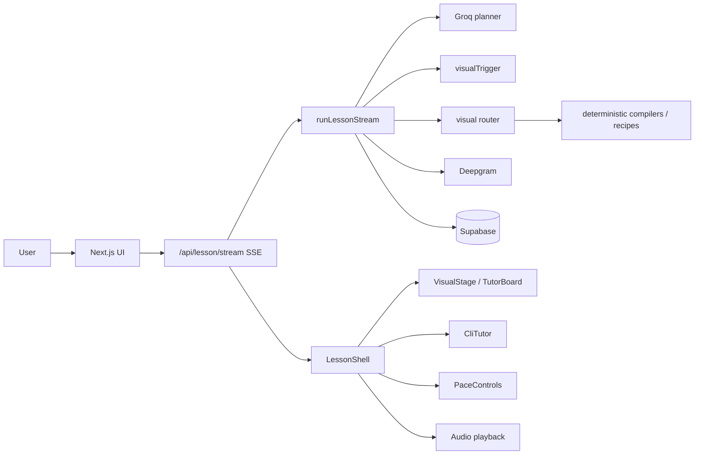

# Magic Whiteboard — Coding Implementation Plan (Seathrough)

> **Status:** Recommended implementation path for this repo.  
> **Supersedes:** the earlier greenfield Fastify / Konva / monorepo draft.  
> **Product vision:** still live in `magic-whiteboard-app-plan.md` (principles only — not a build checklist).

---

## 0. Which approach is better?

| Source | Best for | Verdict |
|---|---|---|
| `magic-whiteboard-app-plan.md` | Product principles, pedagogy, risks, verifier mindset | Strong vision; too broad to implement as written |
| Original coding-plan draft (Fastify + Konva + Redis + monorepo) | Schema, compiler registry, seek, solo build order | Strong engineering patterns; wrong stack for this repo |
| **This document (Seathrough path)** | Shipping on the code you already have | **Prefer this** |

**Bottom line**

- **Better product thinking:** the app plan (teach live on a board; commands ≫ video; LLM plans meaning; code owns pixels).
- **Better engineering patterns:** the coding-plan ideas (Zod contracts, semantic storyboard → compiler, renderer-first, solo order).
- **Better approach to build:** **neither document as written.** Extend **Seathrough** with those patterns. Do **not** greenfield a second stack.

```text
App-plan principles  +  Coding-plan contracts/compilers  +  Existing Seathrough stack
```

---

## 1. Technical Goal

User asks a question → synchronized lesson:

- Progressive whiteboard / diagram reveals
- Equations and labels
- Narration (text + optional TTS)
- Pace controls (pause, skip, speed)
- Follow-ups that know the current visual state

Core rule:

> The AI generates a structured lesson plan. The application renders that plan using deterministic code.

Do not generate finished video. Do not let the model invent raw pixel coordinates for precise diagrams.

---

## 2. Recommended Stack (what you already use)

Keep this. Do not migrate to Konva / Fastify / BullMQ for MVP.

| Layer | Choice | Where it lives |
|---|---|---|
| App | Next.js App Router + TypeScript | `src/app` |
| Board / stage | tldraw + Rough.js + GSAP template reveals | `TutorBoard`, `TemplateStage`, `RoughSketch`, `VisualStage` |
| Specialized visuals | KaTeX, Mermaid, Mafs, curated SVG + anchors | `src/lib/visuals/*`, `src/lib/diagrams/*` |
| Lesson control | XState | `src/lib/lesson/machine.ts` |
| Validation | Zod | `src/lib/schemas/*` |
| Orchestration | Route handler + SSE | `src/app/api/lesson/stream`, `runLessonStream.ts` |
| LLM | Groq (structured plan) | `src/lib/providers/llm.ts` |
| TTS | Deepgram Aura | `src/lib/providers/tts.ts` |
| DB | Supabase (Postgres) | `src/lib/supabase/server.ts` |

**Explicitly deferred / rejected for now**

- Separate Fastify API app
- Redis + BullMQ queues
- Konva as primary board
- Turbo monorepo + terraform
- SymPy microservice (add only when math correctness becomes the bottleneck)
- Absolute `startMs` timeline as the *only* sync model (beats first; optional action timeline later for seek)

---

## 3. Architecture (evolve, don’t rewrite)



**Unit of sync today:** `LessonBeat` (narration + optional visual + TTS).

**Target evolution:** beat still streams first; each visual beat resolves to a **typed visual intent** → **compiler** → render plan. Seek/replay can later expand a beat into timed actions if needed.

---

## 4. Existing code map (start here)

| Concern | Path |
|---|---|
| Stream orchestrator | `src/lib/orchestrator/runLessonStream.ts` |
| Stream route | `src/app/api/lesson/stream/route.ts` |
| Client consumer | `src/lib/client/consumeLessonStream.ts` |
| Beat / stream types | `src/types/lesson.ts` |
| Lesson Zod | `src/lib/schemas/lesson.ts` |
| Scene recipes | `src/lib/schemas/sceneRecipe.ts` |
| Board actions (legacy / light) | `src/lib/schemas/boardActions.ts` |
| Recipe builder | `src/lib/diagrams/buildSceneRecipe.ts` |
| Visual router | `src/lib/visuals/router.ts` |
| Trigger engine | `src/lib/triggers/visualTrigger.ts` |
| Lesson machine | `src/lib/lesson/machine.ts` |
| UI shell | `src/components/LessonShell.tsx` |

---

## 5. Engineering boundary (non-negotiable)

```text
AI outputs
  → Teaching plan / beats (semantic)
  → visualType + typed visualData (no pixels)

Code owns
  → layout, anchors, timing, animation, camera
  → Zod reject / repair
  → specialized renderers (KaTeX, Mermaid, Mafs, SVG templates, Rough)
```

Prompts must include:

- Do not produce pixel coordinates.
- Do not produce animation commands.
- Prefer named visual types that have compilers.
- Do not invent metaphors unrelated to the prompt.

---

## 6. Data contracts to harden

### 6.1 Keep beats as the stream unit

Current shape (simplified):

```ts
type LessonBeat = {
  id: string;
  order: number;
  kind: "intro" | "token" | "visual_shift" | "recap" | "human_summary";
  narration: string;
  visual?: VisualPlan;       // preferred: router plan
  sceneRecipe?: SceneRecipe; // Rough / metaphor recipes
  imageAction: "none" | "generate" | "keep" | "retire";
  paceHintMs?: number;
};
```

### 6.2 Add typed visual intents (coding-plan idea, Seathrough-shaped)

Do **not** use `z.record(z.unknown())`. One schema per visual type:

```ts
// target: src/lib/schemas/visualIntents.ts
export const FractionCirclesIntent = z.object({
  visualType: z.literal("fraction_circles"),
  count: z.number().int().positive().max(24),
  divisions: z.number().int().min(2).max(12),
  labels: z.boolean().default(true),
});

export const NumberLineIntent = z.object({
  visualType: z.literal("number_line"),
  start: z.number(),
  end: z.number(),
  step: z.number().positive(),
  highlight: z.number().optional(),
});

export const EquationStepsIntent = z.object({
  visualType: z.literal("equation_steps"),
  steps: z.array(z.string().min(1)).min(1).max(12),
});

export const VisualIntentSchema = z.discriminatedUnion("visualType", [
  FractionCirclesIntent,
  NumberLineIntent,
  EquationStepsIntent,
  // extend only when a compiler exists
]);
```

### 6.3 Compiler registry

```ts
// target: src/lib/diagrams/compilers/index.ts
type CompileResult = { plan: VisualPlan } | { recipe: SceneRecipe };

const compilers: Record<string, (data: unknown) => CompileResult> = {
  fraction_circles: compileFractionCircles,
  number_line: compileNumberLine,
  equation_steps: compileEquationSteps,
};
```

AI may only emit `visualType` values present in this registry. Unknown types → reject or fall back to text + KaTeX if equations exist.

---

## 7. Pipeline (MVP)

Prefer **one** planner call that returns beats + optional visual intents, then compile locally.

```text
prompt
  → Groq: LessonPlan (Zod)
  → for each beat:
        trigger: generate | keep | retire
        if generate: compile intent → VisualPlan / SceneRecipe
        optional Deepgram TTS
        SSE: beat_start → visual → narration/audio → …
  → human_summary → done
```

Collapse the app-plan’s six LLM stages. Add retrieval / critic / SymPy only after the loop is reliable.

---

## 7.1 Growing the visual library (miss → cache → reuse)

When a topic is **not** in the curated metaphor/asset map, do **not** generate executable code.

Instead:

```text
routeVisual (curated / procedural / generic)
  → if curated: use as-is
  → else lookup visual_library by topic_key
       → hit: reuse validated VisualPlan
       → miss: buildLearnedVisualPlan (Rough recipe JSON)
               → Zod validate
               → remember in Supabase (+ in-memory fallback)
               → render with existing engines
```

| Piece | Path |
|---|---|
| SQL migration | `docs/supabase/003_visual_library.sql` |
| Topic keys | `src/lib/visuals/library/topicKey.ts` |
| Classify quality | `src/lib/visuals/library/classify.ts` |
| Learned plans | `src/lib/visuals/library/proceduralPlan.ts` |
| Store / lookup | `src/lib/visuals/library/store.ts` |
| Orchestrator hook | `resolveVisualWithLibrary` in `runLessonStream` |

**Promote later:** set `quality = 'promoted'` in DB (or copy into `METAPHOR_MAP` / SVG catalog) after a plan proves useful. Rejected topics set `quality = 'rejected'` and are never reused.

**Run migration:** apply `003_visual_library.sql` in the Supabase SQL editor. Until then, process memory still grows within a server lifetime.

### Board scripts (pen writing for unknown topics)

Weak catalog misses no longer become a concept sticker. They become a progressive **board_script**:

```text
4 ÷ 1/2  →  note  →  arrow  →  4 × 2/1  →  8 (boxed)
```

| Piece | Path |
|---|---|
| Schema | `src/lib/schemas/boardScript.ts` |
| Heuristic + LLM analysis | `src/lib/visuals/library/boardScriptPlan.ts` |
| Pen renderer | `src/components/board/BoardScriptStage.tsx` |

Fraction-division prompts use a deterministic heuristic first; other unknowns use structured visual analysis, then cache the script.

---

## 8. Player / UX priorities

Already partly present — finish these before new subjects:

1. Prompt → stream starts with first beat quickly
2. Visual stage updates only when trigger says so (no decorative churn)
3. CLI / narration locked to the same beat
4. Pace: pause, speed, skip beat, replay beat
5. Text-only works if TTS fails
6. Invalid AI payload never reaches the board unvalidated

**Later (not MVP DoD):**

- Object tap → follow-up with selected ids
- True scrub/seek across an absolute ms timeline
- User drawing tools
- Classroom / multiplayer

---

## 9. What to take from each old plan

### From the app plan — keep

- Commands ≫ generated video
- Progressive disclosure; one visual purpose per moment
- Math/science niche first
- Deterministic compiler; layout templates not free coords
- Verifier mindset (correctness, sources, uncertainty labels)
- “Ten excellent lessons” milestone over “any question”

### From the app plan — ignore for now

- 40+ whiteboard action types
- Microservices (gateway, storyboard service, validation service, …)
- Konva/Pixi as required stack
- Full LMS / classrooms / marketplace
- Eight-week “full product” roadmap

### From the original coding plan — keep

- Renderer / hard-coded lesson before trusting AI
- Zod everywhere on AI boundaries
- Semantic storyboard → compiler registry
- Seek-via-rebuild *when* you need scrubbing
- Solo priority order (templates before voice polish)
- Versioned prompts as code

### From the original coding plan — ignore

- New monorepo + Fastify + Redis + BullMQ + terraform
- Konva scene graph as primary renderer
- Auth/history week before compiler works
- Fat MVP DoD (seek + follow-ups + math service + mobile all at once)

---

## 10. Build order (solo / this repo)

1. **Stabilize contracts** — tighten Zod for beats + `VisualPlan` / intents; reject bad payloads in the stream.
2. **Visual library growth** — miss → learned Rough plan → cache → reuse (`003_visual_library.sql` + `src/lib/visuals/library`).
3. **Three compilers** — e.g. equation steps, number line, fraction circles (or the metaphors you already teach best).
4. **Wire planner → intents → compilers → router** — no pixels from the model.
5. **Hard-authored golden lessons** — 3–5 lessons that feel like a good teacher; use as regression fixtures.
6. **Pace + interrupt** — XState + GSAP/TTS kill on skip/interrupt.
7. **Persistence polish** — Supabase lesson save/replay (already started).
8. **One follow-up path** — current board/visual summary in context (object ids later).
9. **Verification** — arithmetic/algebra checks where needed; don’t boil the ocean.
10. **Only then** — new subjects, richer timeline seek, teacher editor.

Voice is already partially wired; treat sync reliability as higher priority than new voices or handwriting flair.

---

## 11. Definition of Done (realistic MVP)

Done when:

- [ ] User enters a question
- [ ] SSE streams a validated lesson
- [ ] Board/visual updates progressively with teaching purpose
- [ ] Narration stays on the active beat (text always; audio when available)
- [ ] Pause / speed / skip work without desync
- [ ] Invalid model output is rejected or repaired — never paints garbage
- [ ] At least three golden lessons feel clear to a real learner
- [ ] Lessons persist in Supabase

Not required for MVP:

- Absolute timeline scrubbing
- Object-level Q&A
- SymPy service
- Separate API process
- Mobile-perfect camera choreography

---

## 12. Testing checklist (edge cases)

After each milestone, verify:

| Case | Expected |
|---|---|
| Empty prompt | Error event; no hang |
| Invalid / partial JSON from LLM | Reject; user-visible error or safe retry |
| Missing env keys (LLM / TTS / Supabase) | Clear failure; text path if TTS down |
| TTS slow / fail | Lesson continues with captions |
| User pauses mid-beat | Board + audio freeze together |
| Skip / interrupt | No orphan audio; next beat clean |
| Visual retire | Stage clears or swaps without flicker junk |
| Unrelated metaphor temptation | Trigger/router blocks decorative nonsense |

---

## 13. Final recommendation

**Use this file as the implementation plan.**  
**Use `magic-whiteboard-app-plan.md` as product doctrine only.**

The winning approach is:

> Seathrough’s visual-router + beat stream + curated/deterministic renderers, upgraded with the coding plan’s typed intents, compilers, and validation discipline — guided by the app plan’s teaching principles.

The losing approach is:

> Restarting with Konva + Fastify + Redis to chase a generic “magic whiteboard engine” before ten lessons feel excellent.
